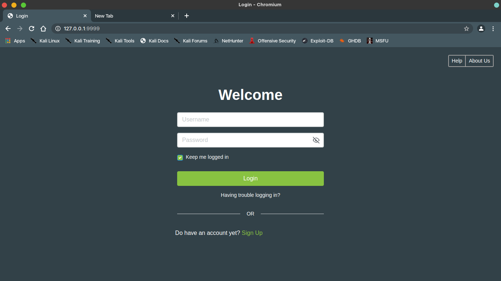
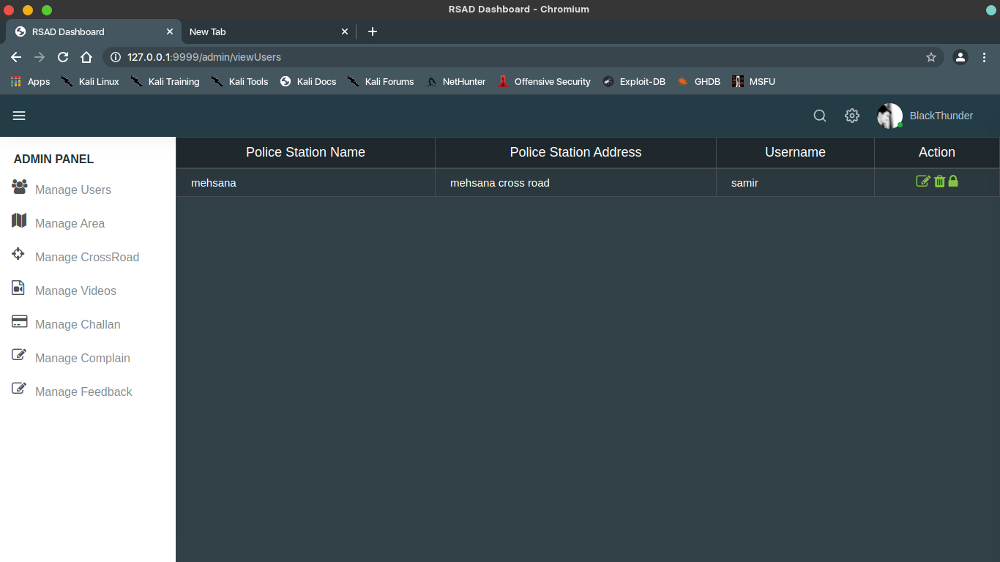
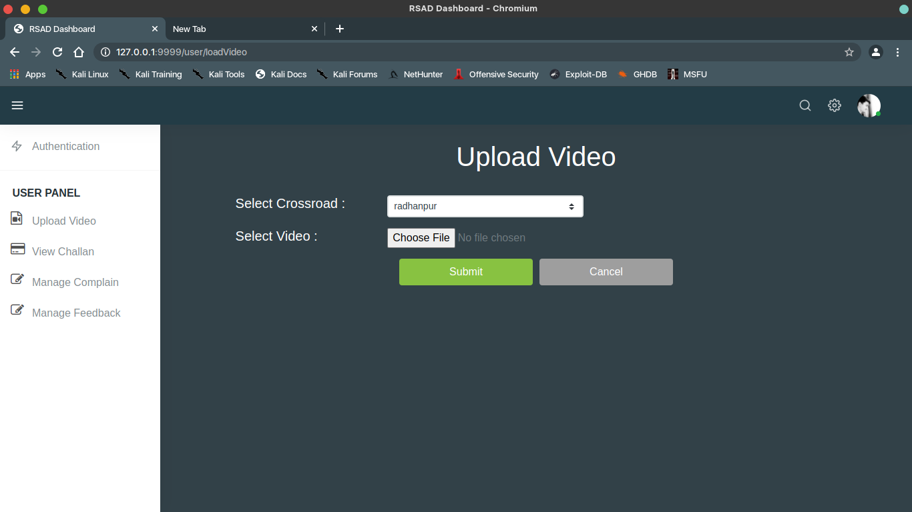
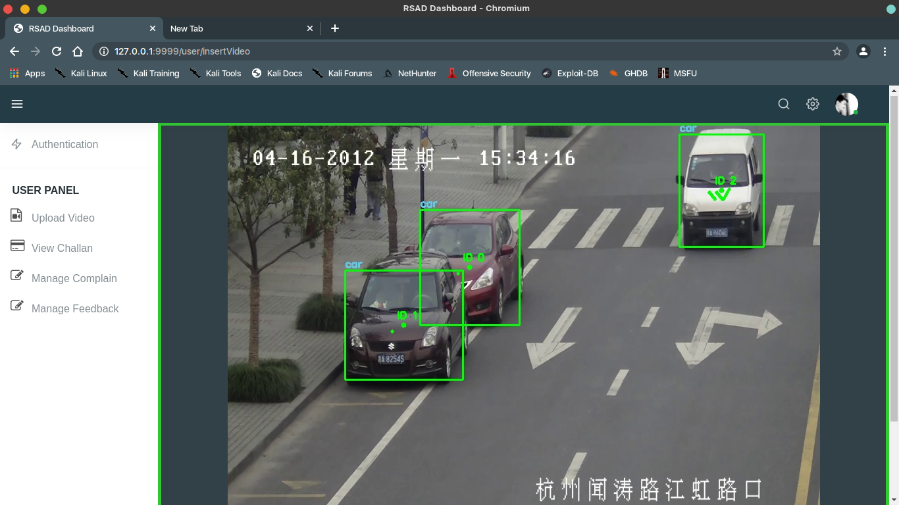
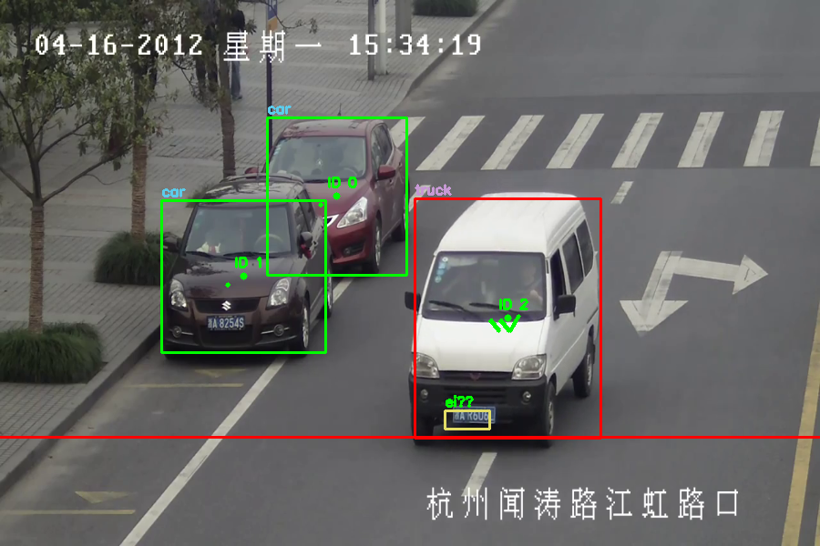
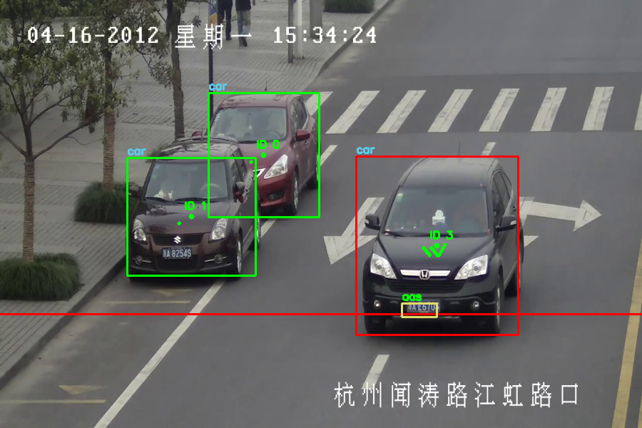
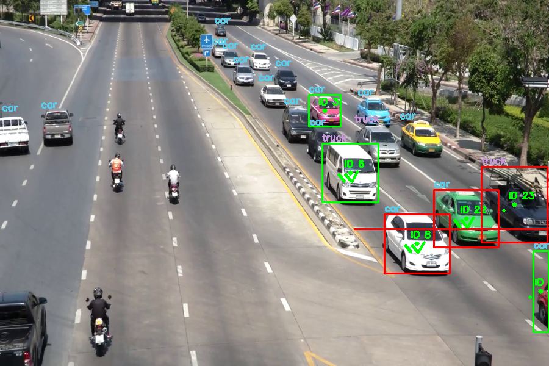
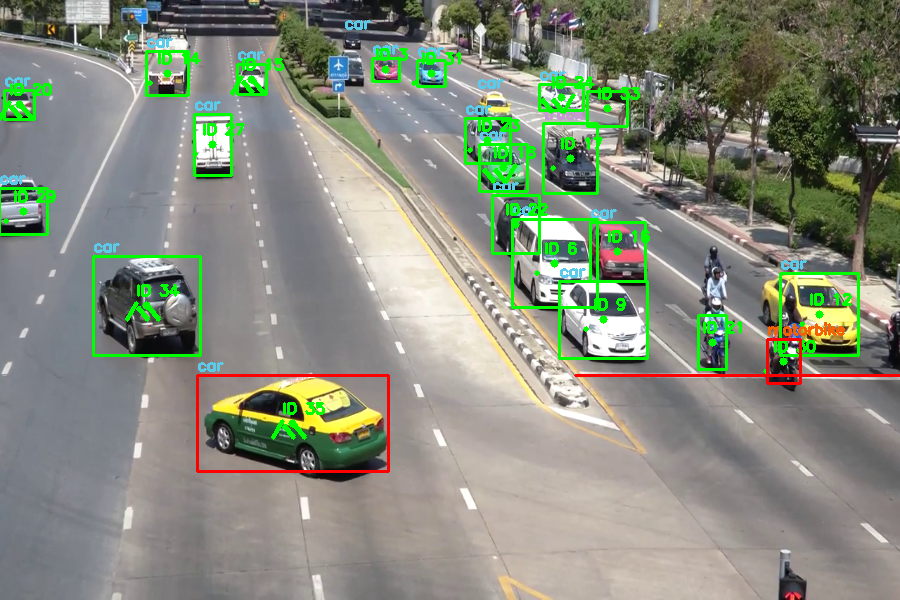

# RSAD (Road Side Anomaly Detection)
1. The basic goal of this system is to detect the anomalous traffic events include
Vehicles driving in the lane’s opposite direction, drivers not wearing the helmets,
Vehicles standing beyond the stop lane and vehicle creating the road traffic. An
immediate detector on any of these situation can help us prevent the serious accidents by
warning the oncoming vehicles & police.
2. Due to the above reasons we have developed “AI based road side Anomoly
Detection” System which detects the vehicles not following the traffic rules, creating
unusual traffic, coming in the marked lane. Our system defects these vehicles and creates
challan and send to the owner of vehicle.

## Tools and Technology
1. Python with following moduls:
   - Flask
   - OpenCV
   - TesseractOCR
   - Tensorflow
   - scipy
2. Yolo detection model
   - Download YoloV3 from this link https://pjreddie.com/darknet/yolo/
   - Extract file in RSAD/static/Dataset/Model and rename folder with yolo_v3
   - Or download weights from [google drive](https://drive.google.com/drive/folders/13fK48hyiq7APCaV0ZtPk3Q45DAEbjI6K?usp=sharing) and extract into RSAD/static/Dataset/Model folder
3. MySql
   - Create database with name "RSAD"
   - Change database username and password in RSAD/__init__.py file
## How to run
1. run python Main.py in terminal
## Snapshots
1. Login

2. admin

3. user

4. Detection

5. Outputs

